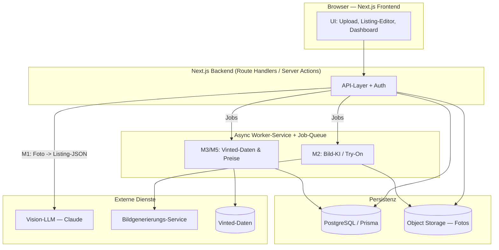

# VintageApp — Konzept & Architektur

> Stand: 2026-06-17 · Status: Konzeptphase (kein Code) · Zielstack: Next.js + TypeScript

Dieses Dokument fasst die Produktvision der **VintageApp** zusammen und beschreibt
Module, technische Architektur, rechtliche Rahmenbedingungen und eine Umsetzungs-Roadmap.
Es ist die gemeinsame Grundlage, um die App-Idee zu schärfen, **bevor** Code entsteht.

Grundlage ist der Chatverlauf in `Textdokument (neu).txt` sowie die dort recherchierten
Wettbewerber (vintagezai.com, VintyLook, AutoLister AI u. a.).

---

## 1. Vision & Problemstellung

**Problem.** Das manuelle Einstellen eines Artikels auf Vinted dauert ca. **10 Minuten**:
fotografieren, Titel schreiben, Beschreibung formulieren, Marke/Größe/Kategorie/Zustand
auswählen, Preis recherchieren, Hashtags setzen. Wer hunderte Artikel verkauft
(Reseller), verliert dadurch enorm viel Zeit — und lässt durch schlechte Fotos und
unscharfe Preise Umsatz liegen.

**Lösung.** VintageApp bündelt alle Schritte des Upload- und Verkaufsprozesses in **einer**
Web-App. Ziel: **Listing-Zeit von ~10 Minuten auf unter 1 Minute** senken, bei besserer
Qualität (KI-Texte, getragen aussehende Fotos, datenbasierte Preise) und voller
Finanz-Transparenz.

**Positionierung.** „Professional Reseller Toolkit" — eine integrierte Plattform statt
fünf einzelner Tools. Das ist die zentrale Lücke im Markt (siehe §2): Heute kombinieren
Verkäufer KI-Listing-Tools, Foto-Tools und Analytics-Tools manuell. VintageApp führt sie
zusammen und ergänzt eine **Finanzübersicht**, die kein direkter Wettbewerber bietet.

---

## 2. Marktüberblick

Zusammenfassung der im Chatverlauf recherchierten Tools, kategorisiert nach Funktion.

| Tool | Kategorie | Funktion | Preis (Anhalt) |
|------|-----------|----------|----------------|
| **PreLoved AI** | KI-Listing | Erkennt Stoff/Stil/Marke/Farbe/Zustand aus Fotos, schreibt Titel + Beschreibung | ab £26,99/Mo |
| **AutoLister AI** | KI-Listing | Browser-Extension, Foto → Listing in Sekunden; imitiert menschliches Tippen | kostenlos starten |
| **SharkScribe AI** | KI-Listing | KI-Beschreibungen aus Produktfotos, Community-Ton | – |
| **QuickListAI** | KI-Listing | Foto-Katalogisierung, Auto-Titel/Beschreibung/Größe/Hashtags | – |
| **Katapic** | KI-Listing | Schnelle Foto-zu-Listing-Generierung | – |
| **VintyLook** | Foto-KI | Erzeugt „getragen aussehende" Bilder aus Flat-Lays | ab €3,49 / 10 Credits |
| **Dotb Bot** | Automation | Chrome-Extension für Relisting + Käufer-Antworten (nutzt private API) | ab €5,99/Mo |
| **Redrip** | Automation | Kostenloses Relisting, 100 % lokale Datenhaltung | kostenlos |
| **Monitorius** | Automation/Analytics | Echtzeit-Listing-Monitoring + Trend-/Relist-Logik | – |
| **VintiePlus** | Analytics/Sniping | 24/7-Sniping unterbewerteter Artikel, Inventar + Analytics (>10 Mio. Listings/Tag) | ab €29,95/Mo |
| **Vinted Infoboard** | Analytics | Echtzeit-Marktdaten, Sell-Through-Raten (Pilot) | – |
| **Vendoo** | Cross-Listing | Gleichzeitiges Listing auf 11 Plattformen (eBay, Poshmark, Depop, …) | ab €14,99/Mo |

**Marktstruktur.** Zwei Lager: (a) Tools, die den **Upload beschleunigen** (KI-Listing,
Foto-KI), und (b) Tools, die **nach dem Upload Sichtbarkeit** schaffen (Relisting, CRM,
Analytics). Die meisten Verkäufer brauchen beides.

**Unsere Lücke.** Niemand bündelt KI-Listing + Getragen-Look-Fotos + datenbasierte
Preise + **Finanzübersicht** in einem Produkt. Genau das ist VintageApps Differenzierung.

---

## 3. Module / Feature-Set

Jedes Modul ist als eigenständige Einheit konzipiert (separat ausrollbar), teilt sich
aber Datenmodell und UI-Shell.

### M1 — KI-Listing aus Foto  *(Kern-MVP)*
- **Was:** Aus einem oder mehreren Produktfotos ein vollständiges Listing generieren.
- **Input → Output:** Foto(s) → strukturiertes JSON: `titel`, `beschreibung`, `marke`,
  `größe`, `kategorie`, `zustand`, `farbe`, `material`, `hashtags[]`.
- **KI/Datenquelle:** Vision-fähiges LLM. **Empfehlung: aktuelles Claude-Modell mit
  Vision** — Claude Opus 4.8 (`claude-opus-4-8`) für höchste Qualität, alternativ
  Sonnet 4.6 (`claude-sonnet-4-6`) als günstigere/schnellere Variante. Strukturierte
  Ausgabe via Tool-Use/JSON-Schema, damit die Felder direkt ins Formular fließen.
- **Aufwand:** Mittel. Kern ist Prompt-Design + Schema + Bild-Upload-Pipeline.

### M2 — Getragen-Look-Fotos
- **Was:** Aus einem Flat-Lay (Kleidungsstück flach fotografiert) ein realistisches
  „getragenes" Bild erzeugen — ohne Model, Shooting oder Photoshop.
- **Input → Output:** Flat-Lay-Foto → 1–n generierte Trage-Bilder (verschiedene Posen/Modelle).
- **KI/Datenquelle:** Virtual-Try-On- / Diffusion-Bildmodell (Anbieter offen, siehe §8).
- **Aufwand:** Hoch (Bildqualität, Konsistenz, Rechenkosten, Latenz → eigener Worker).
- **Wirkung:** Im Chatverlauf belegt — stagnierte Artikel verkauften sich nach Neueinstellung
  mit Trage-Bildern teils innerhalb von 48 h.

### M3 — Preisvorschläge
- **Was:** Datenbasierte Preisempfehlung für einen Artikel.
- **Input → Output:** Artikelmerkmale (aus M1) → empfohlener Preis + Spanne (min/max) +
  Konfidenz, basierend auf vergleichbaren Vinted-Artikeln (Median aktiver/verkaufter Listings).
- **KI/Datenquelle:** Vergleichsdaten von Vinted (Datenquelle/Beschaffung offen, siehe §8);
  einfache Statistik (Median, Quartile) genügt zunächst, ML später.
- **Aufwand:** Mittel — abhängig von der Verfügbarkeit der Vergleichsdaten.

### M4 — Finanzübersicht
- **Was:** Dashboard über die wirtschaftliche Lage des Verkäufers.
- **Input → Output:** Transaktionen/Artikel → Kennzahlen: Umsatz, Gewinn, Gebühren,
  Lagerwert, ROI je Artikel, Bestseller, Liegezeit.
- **KI/Datenquelle:** Eigene DB (manuelle Erfassung von Einkaufspreis/Verkauf, später Import).
- **Aufwand:** Niedrig–mittel (reine Daten-/Charting-Arbeit, keine KI nötig).
- **Differenzierung:** Bietet kein direkter Wettbewerber integriert an.

### M5 — Vinted-Produktfindung *(optional, späte Phase, rechtlich sensibel)*
- **Was:** Bot-gestützte Suche nach unterbewerteten Artikeln (Sniping) zum Wiederverkauf.
- **Input → Output:** Suchkriterien → Liste von Funden mit geschätzter Marge.
- **KI/Datenquelle:** Kontinuierliche Vinted-Suche + Bewertung gegen M3-Preisdaten.
- **Aufwand:** Hoch + **rechtlich riskant** (siehe §5). Bewusst nach hinten priorisiert.

---

## 4. Technische Architektur

### Stack
- **Frontend/Full-Stack:** Next.js (App Router) + TypeScript, Tailwind CSS, React Server
  Components + Server Actions.
- **Backend:** Next.js Route Handlers für leichte APIs; **separater Worker-Service** für
  rechenintensive/asynchrone Bild-KI (M2) und langlaufende Crawls (M3/M5) via Job-Queue.
- **Datenhaltung:** PostgreSQL via Prisma (Artikel, Listings, Preisdaten, Finanzen);
  Object Storage (z. B. S3-kompatibel) für Fotos/generierte Bilder.
- **KI-Integration:**
  - M1: LLM mit Vision → strukturiertes JSON (Tool-Use/Schema).
  - M2: Bildgenerierungs-/Try-On-Service über asynchrone Jobs.
  - M3/M5: Daten-/Scraping-Schicht → Statistik-Layer.
- **Auth:** Session-/Token-basiert (z. B. Auth.js), pro Nutzer getrennte Daten.

### Übersicht

### Datenmodell (Skizze)

| Entität | Wichtige Felder | Zweck |
|---------|-----------------|-------|
| `User` | id, email, plan | Konto + Abo-Stufe |
| `Item` | id, userId, marke, größe, kategorie, zustand, einkaufspreis | Physischer Artikel im Bestand |
| `Listing` | id, itemId, titel, beschreibung, hashtags, status | KI-generiertes/veröffentlichtes Inserat |
| `PhotoAsset` | id, itemId, typ (flatlay/worn), url | Original- & generierte Fotos |
| `PriceSuggestion` | id, itemId, empfohlen, min, max, konfidenz, quelle | Ergebnis von M3 |
| `Transaction` | id, itemId, verkaufspreis, gebühren, datum | Grundlage der Finanzübersicht (M4) |

---

## 5. Vinted-Integration & rechtliche Hinweise

> **Wichtig:** Dieser Abschnitt ist bewusst prominent. Mehrere Wunsch-Features berühren
> Vinteds AGB. Die Architektur muss erlauben, riskante Module bewusst an-/abzuschalten.

- **Zwei Automatisierungs-Ansätze:**
  - *Menschen-imitierend* (UI-Automatisierung, „tippt wie ein sehr schneller Mensch", keine
    private API): laut Chatverlauf praktisch nicht von der Bot-Erkennung unterscheidbar.
    Vinted erkennt **nicht die Extension**, sondern auffälliges Verhalten (zu schnelles
    Pacing, keine Pausen, gleichmäßiges Timing).
  - *Private-API-Nutzung/Scraping* (z. B. Dotb für Massen-Aktionen): höheres Risiko.
- **Risiken:** Verstoß gegen Vinted-AGB, Gefahr der **Account-Sperrung**, mögliche
  Unterlassungsforderungen. Daten von Vinted-Nutzern unterliegen der **DSGVO** (insb. bei
  Personen-/Bilddaten in generierten Trage-Fotos).
- **Empfehlung:** Konservativer, möglichst AGB-konformer Ansatz. M1–M4 lassen sich weitgehend
  AGB-konform umsetzen (eigene Fotos, eigene Daten). **M5 (Produktfindung) und jegliches
  Auto-Upload** werden als explizite **Risiko-Phase** markiert und erst nach rechtlicher
  Bewertung umgesetzt. Keine Speicherung privater Vinted-API-Zugänge ohne Prüfung.

*Hinweis: Dies ist keine Rechtsberatung. Vor M5/Auto-Upload juristische Prüfung einholen.*

---

## 6. Roadmap

| Phase | Inhalt | Ergebnis |
|-------|--------|----------|
| **0** | Scaffold: Next.js + TS, Tailwind, Auth, Prisma-Datenmodell, Foto-Upload | Lauffähiges Grundgerüst |
| **1** | **M1 — KI-Listing aus Foto** | Kern-MVP: Foto → fertiges Listing |
| **2** | **M3 — Preisvorschläge** + **M4 — Finanzübersicht** | Datenbasierter Preis + Finanz-Dashboard |
| **3** | **M2 — Getragen-Look-Fotos** | Trage-Bilder aus Flat-Lays |
| **4** | **M5 — Produktfindung** | Sniping — *nur nach rechtlicher Bewertung* |

---

## 7. Monetarisierung

Freemium + gestaffeltes Abo (analog zum Wettbewerb), gestaffelt nach Artikel-Volumen/Monat
und freigeschalteten Modulen:

- **Free:** wenige Listings/Monat, nur M1 (Basis), Wasserzeichen bei M2.
- **Pro:** höheres Volumen, M2/M3 ohne Limit, Finanzübersicht.
- **Business:** unbegrenzt, Priorität bei Bild-KI, (später) M5/Cross-Listing.

Preis-Anker am Markt: ~£27/Mo (PreLoved AI), ~€30/Mo (VintiePlus) → Pro-Tier im Bereich
€15–30/Mo realistisch.

---

## 8. Offene Fragen / nächste Entscheidungen

1. **Bild-KI-Anbieter für M2** — welcher Virtual-Try-On-/Diffusion-Service (Qualität,
   Kosten, Rechte an generierten Bildern)?
2. **Datenquelle für Preisvergleich (M3)** — wie werden Vinted-Vergleichsdaten beschafft
   (AGB-konform)? Eigene Erfassung, Partnerschaft, oder Drittanbieter-Daten?
3. **Hosting** — Vercel (Next.js nativ) vs. eigener Cloud-Stack für die Worker?
4. **Rechtliche Prüfung** für M5 / jegliches Auto-Upload, bevor diese Phase startet.
5. **Cross-Listing** (eBay/Depop/…, wie Vendoo) — als späteres Zusatzmodul aufnehmen?
